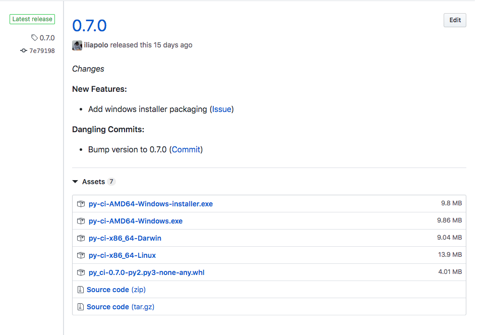
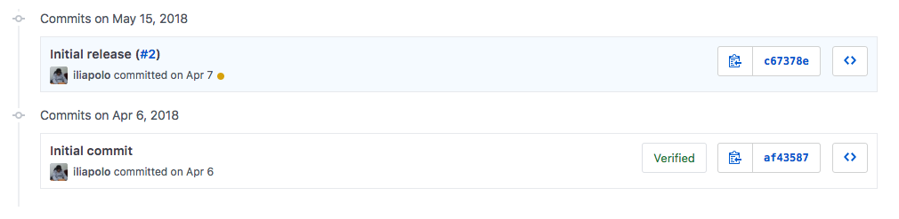
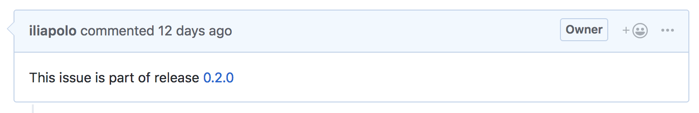

[](https://travis-ci.org/iliapolo/pyci)
[](https://requires.io/github/iliapolo/pyci/requirements/?branch=release)
[](https://codecov.io/gh/iliapolo/pyci)
[](https://pypi.org/project/py-ci/)
[](https://pypi.org/project/py-ci/)
[](https://pypi.org/project/py-ci/)
[](https://github.com/iliapolo/pyci)

PyCI provides a set of opinionated CI related operations, specifically built for Python projects.

## Why should I use it?

- If you own/maintain a python project on GitHub.

- If you want rapid and automatic releases.

- If you ever had to write and maintain a script to release your project, and are sick of it.
 
- If you want pretty changelogs.

- If you're building a CLI, and want users to easily install and run it.

- If you want to stop thinking about version numbers.

- If you want a CI agnostic release process.

## Not planning to use PyCI?

No hard feelings, but I would really love to know why :)

- Are you missing a feature?
- Does it not fit with your project workflow?

If you could spare a minute or two to simply explain your choice as a comment in 
[this](https://github.com/iliapolo/pyci/issues/30) issue, that would be great, if not, that's ok 
too.

**Currently only supported for projects hosted on Github and running CI on either 
[Travis](https://travis-ci.org/), and or [Circle](https://circleci.com/), 
and or [Appveyor](https://www.appveyor.com/)**


## Notable Features

Honestly, there is currently just one notable feature :)  

* [Fully automated release process](https://github.com/iliapolo/pyci#release)

As part of implementing it though, I had to implement a few other sub-features which are exposed 
separately as well.

* [Changelog generation](https://github.com/iliapolo/pyci#changelog-generation)
* [Packaging to various formats](https://github.com/iliapolo/pyci#packaging)
* [Remote GitHub commits](https://github.com/iliapolo/pyci#remote-github-commits)

### Release  

###### Usage → pyci release --help
<details closed>
<summary>Show</summary>

```text
Usage: pyci release [OPTIONS]

  Execute a complete release process.

  This command will do the following:

      1. Execute a github release on the specified branch. (see 'pyci github
      release --help')

      2. Create and upload a platform dependent binary executable to the
      release. (Optional)

      3. Create and upload a wheel package to PyPI. (Optional)

Options:
  --repo TEXT                 Github repository full name (i.e:
                              <owner>/<repo>). When running inside a CI
                              system, this will be automatically detected
                              using environment variables.
  --branch-name TEXT          The name of the branch you want to release. The
                              defaulting heuristics are as follows: 1) The
                              branch the build was triggered on. 2) The
                              default branch name of the repository.
  --master-branch-name TEXT   The master branch name. That is, the branch that
                              should point to the latest stable release.
                              Defaults to master.
  --release-branch-name TEXT  The release branch name. That is, the branch
                              that releases should be made from. This is used
                              to silently ignore commits made to other
                              branches. Defaults to the repository default
                              branch.
  --pypi-test                 Use PyPI test index. This option is ignored if
                              --no-wheel is used.
  --pypi-url                  Specify a custom PyPI index url. This option is
                              ignored if --no-wheel is used.
  --binary-entrypoint TEXT    Path (relative to the repository root) of the
                              file to be used as the executable entry point.
                              This corresponds to the positional script
                              argument passed to PyInstaller (https://pythonho
                              sted.org/PyInstaller/usage.html)
  --wheel-universal           Should the created wheel be universal?.
  --force                     Force release without any validations.
  --no-wheel                  Do not create and upload a wheel package to PyPI
                              as part of the release process.
  --no-binary                 Do not create and upload a binary executable as
                              part of the release process.
  --help                      Show this message and exit.
```
</details>

<br>
The release command integrates with your existing CI providers and enables continuous release of 
the project. All you have to do is invoke the command at the end of your CI workflow. 

For example, if you use tox, just add it as the last command: (this is the actual tox
file PyCI itself uses) 

```ini
[tox]
envlist = py27, py36

[testenv]
deps =
    -rtest-requirements.txt
passenv = CI TRAVIS TRAVIS_* CIRCLECI CIRCLE_* APPVEYOR APPVEYOR_* GITHUB_ACCESS_TOKEN TWINE_*
commands =
    pylint --rcfile pylint.ini pyci
    py.test -rs -c pytest.ini --cov-config=coverage.ini --cov=pyci pyci/tests
    codecov
    pyci release

``` 

PyCI will detect the CI provider and perform a release of the associated commit.

```text
    ___    _  _    ___     ___
   | _ \  | || |  / __|   |_ _|
   |  _/   \_, | | (__     | |
  _|_|_   _|__/   \___|   |___|
_| """ |_| """"|_|"""""|_|"""""|
"`-0-0-'"`-0-0-'"`-0-0-'"`-0-0-'

* Detected CI Provider: CircleCI
→ Releasing branch 'release'
  → Validating build https://circleci.com/gh/iliapolo/pyci/420
    * Build is not a PR... ✓
    * Build is not a TAG... ✓
    * Build branch is 'release'... ✓
  → Validating commit
    * Commit references an issue... ✓
    * Issue is labeled with a release label... ✓
  → Generating changelog
    * Collecting commits
    → Analyzing 2 commits
      * Initial release (#2) ✓
      * Initial commit ✓
  * Bumping version to 0.2.0
  * Creating a GitHub release
  * Uploading changelog... ✓
  * Updating release branch... ✓
  * Updating master branch... ✓
  → Closing issues
    * Closing issue number 1... ✓
→ Creating and uploading packages
  → Binary
    * Packaging binary... ✓
    * Uploading py-ci-x86_64-Linux... ✓
  → Wheel
    * Packaging wheel... ✓
    * Uploading py_ci-0.2.0-py2.py3-none-any.whl... ✓     
→ Hip Hip, Hurray! :). Your new version is released and ready to go.
  * Github: https://github.com/iliapolo/pyci/releases/tag/0.2.0
  * PyPI: https://pypi.org/manage/project/py-ci/release/0.2.0/
```

Once the command completes, navigate to the release on GitHub. You should see something like this:

[](./assets/release.png)

So what is happening here? Lets break it down:

1. *Changes*
    
    This is the obviously the changelog of the release. To understand it we first have took at 
    the commits prior to executing the release.
    
    [](./assets/commits.png)
        
    Now its clear what we see:
        
    - **New Features**

      This contains a single commit that references issue number 2, which is labeled with the 
      *feature* label.
          
    - **Dangling Commits**
    
      This section contains  two commits:
        
        - Initial Commit: This is just the commit Github made when I created the repo.
        
        - Bump version to 0.2.0: This commit didn't actually exist prior to the release, it was 
          made by PyCI to bump the version of setup.py. and it is also considered a dangling commit. 
    
    For a more detailed explanation, see [Changelog generation](https://github.com/iliapolo/pyci#changelog-generation).
    
    
2. *0.2.0*

    This is the release title and version. How did PyCI know to assign this number?
    
    Similarly to the changelog generation, PyCI analyzes the relevant commits and finds which of 
    them have an influence on the version number. This means that you do not have any say in 
    determining it.
    
    What do I mean by influence? see [Versioning a release](https://github.com/iliapolo/pyci#versioning-a-release).

3. *Assets* 

    This part contains assets PyCI automatically created and uploaded to the release. If PyCI detects
    that your project can be used as a CLI, it will attempt to create an isolated, platform dependent, 
    binary executable file. In our case, since PyCI is tested on all 3 platforms, 
    3 executables were created.
    
    For a more detailed explanation, see [CLI Detection](https://github.com/iliapolo/pyci#cli-detection).

In addition to the GitHub release, PyCI also did the following:

- Uploaded a wheel package to PyPI.
- Issue number 2 was automatically closed and a comment was added to it:

    [](./assets/comment.png)

- Master branch was reset to the commit of the release. This way master branch always points to 
the last stable release.

#### Getting Started

Here is what you do if you want to start releasing your project using PyCI.

1. Create the following labels in your GitHub repo:


    - feature
    - bug
    - patch
    - minor
    - major


2. Create an issue for the feature/bug you want to implement and label it accordingly.
3. Checkout from master to a feature branch.
4. Implement and create a PR referencing the issue in the body.
5. Merge the PR via Github. The commit message will by default reference the PR, make sure you 
dont remove that reference.
6. Wait for the release to complete.
7. Go to 3.

#### Triggering a release

Ideally, every push you make to the main branch should trigger a release. 

However, sometimes you just want to push a README fix, or maybe some refactoring. It doesn't
really make sense to trigger a release on every single commit. Also, releases should only be 
triggered if you push to the main branch, and not any other branch. For this reason, PyCI does 
some validation on the commit before it actually attempts to release it:

* Build validation 

    The build branch must be the main branch. That is, builds for tags, pr's, or branches that 
    differ from the main branch, will not trigger the release process. Instead, you will see 
    something like this:
    
    ```text
    * Detected CI Provider: CircleCI
    → Releasing branch 'release'
      → Validating build https://circleci.com/gh/iliapolo/pyci/421
        * Build is not a PR... ✓
        * Build is not a TAG... ✓
        * Build branch is 'release'... ✗
    * Not releasing: Commit e2a88d94c322536a3fcfbaf26d0d1fb2a31bbbe4 does not reference any issue
    ```

* Commit validation

    The commit must be associated with an issue, and the issue must be labeled with one of the 
    release labels.
    
    Any other commit, will trigger your CI, but **wont** trigger a release. Instead, you will see 
    something like:
    
    ```text
    * Detected CI Provider: CircleCI
    → Releasing branch 'release'
      → Validating build https://circleci.com/gh/iliapolo/pyci/421
        * Build is not a PR... ✓
        * Build is not a TAG... ✓
        * Build branch is 'release'... ✓
      → Validating commit
        * Commit references an issue... ✗
    * Not releasing: Commit e2a88d94c322536a3fcfbaf26d0d1fb2a31bbbe4 does not reference any issue
    ```

Notice that in such cases, the command exists successfully, so as to not fail the build.

#### Versioning a release

PyCI uses the [Semantic Versioning](https://semver.org/) scheme along with Github issues to 
automatically determine the version of the next release. 

The release command [detects](https://github.com/iliapolo/pyci#issue-detection) the issue that was 
referenced by the commit (that triggered the release) and fetches the issue labels. 
If the issue is labeled with the *patch* label, a *patch* bump is performed, and so forth...

Sometimes though, you might wind up in a situation where you have multiple un-released commits 
that reference a release issue. In such a case, PyCI will apply all corresponding bumps in order 
of issue creation.

A version bump is a commit made to the setup.py file, replacing the current version with the new
one. To determine the current version, PyCI runs the `python setup.py --version` command. Setting 
the new version is done a regex to replace the `'version='` keyword argument. This means that you 
cannot do any fancy things for this arg, like calculate stuff or invoke functions. Keep it simple
and let PyCI manipulate and determine version numbers. 

#### Concurrency

Many projects run concurrent CI jobs. These can be when testing different versions of Python, or 
running on multiple CI providers to cover all operating systems 
([AppVeyor](https://www.appveyor.com/) basically). For this reason, the command needs to be 
safe for concurrent executions. 

Every step in the command follows the *skip-existing* paradigm, so you don't have to worry about it.

**However**, there is one scenario where concurrent executions may cause a failure, when the 
executions run with **different** commits. 
It can happen if for example a pull request is merged into the release branch before the previous
pull request execution completed. 

At this point you might be thinking: "Hold on, this is exactly how we work now! I cant use this 
tool!". Well, if this is your scenario, you are most likely still running conventional release 
processes. That is:

1. Developers branch out from the main branch.
2. Feature branches are merged to the main branch via Github.
3. Repeat 1-2 for like a week or two.
4. Arbitrarily release the main branch.

If you want to stick to this workflow, PyCI is probably not the tool for you at the moment.

In order to use PyCI for release, you have to accept the following statement: *Every merged pull 
request triggers a release*. This is the core mindset of continuous release, and works best with 
the following workflow:  

1. Developers branch out from master to feature branches.
2. Feature branches are merged to the main branch via Github (usually 'develop' or 'release').
3. PyCI releases the main branch and updates master branch to the latest release.
4. Go to 1.

Another popular flow is to simply have the 'master' branch be the main branch.

Now you see that merging two PR's at the same time would be like running the conventional 
release process concurrently (which is usually a big no no).

Since PyCI makes the release process automatic and fast, there really is no reason not to 
wait for one merge to complete before merging another branch. It shouldn't delay your development
cycle, and is really just a matter of discipline.

Having said that, mistakes do happen, especially when more than one person can approve pull 
requests. So lets take a look at what happens in this scenario.

There are two ways it can develop:

- Second pr is merged before **any** of the previous pr's jobs got a chance to create the release.

    As part of the release process, PyCI pushes a commit on top of the release branch to bump the 
    version of setup.py. The parent of this commit is **always** the commit that triggered the 
    build. This is to make sure no other commits wind up in the release.
    Now imagine the last commit of the branch is the second pr, what will happen? When PyCI will 
    attempt to push, it will fail because it wont be a fast-forward.
    
    In this case, merging the second pr will actually cause all prior executions to fail. Now, 
    this might be ok, because the second pr itself will be released and include the first pr as 
    well. The only affect is that you will have a "gap" in your releases.
    
- Second pr is merged after **one** of the previous pr's jobs had already created the release.
    
    In this case, everything will work as expected since all other executions will detect the 
    release was already created and simply use it. Allowing for two release processes to take 
    place at the same time.

Obviously you cant know which will happen, which is why its best to avoid this scenario altogether.
But even if you cant, you should still be good to go.

### Changelog Generation

Changelog is generated by analyzing the commits made to the branch **after** the **previous** 
(not **last**!) release. Basically, here is how it works:

1. Fetch all commits prior (including) mine in descending order. 
2. Iterate over them and stop when we find a commit that points to a release.
3. All commits before we stop, should be a part of the changelog.

Note that this guarantees that you can generate a changelog for every commit, always, regardless 
of which versions are released.

Each commit is then categorized into one of: (see [Issue detection](https://github.com/iliapolo/pyci#issue-detection))

    - Feature
    - Bug
    - Issue
    - Dangling Commit 

If a *feature* (or *bug*) label if found, the commit is categorized as a feature (or bug). 
If these labels are not found, the commit is categorized as a regular issue. If the commit 
does not reference any issue, the commit is left "Dangling".

### Packaging

###### Usage → pyci pack --help
<details closed>
<summary>Show</summary>

```text
Usage: pyci pack [OPTIONS] COMMAND [ARGS]...

  Sub-command for packing source code.

  Notice that in case neither --sha nor --path are provided, the last commit
  from your repository's default branch will be used.

Options:
  --repo TEXT  Github repository full name (i.e: <owner>/<repo>). When running
               inside a CI system, this will be automatically detected using
               environment variables.
  --sha TEXT   Pack a specific sha.
  --path TEXT  Pack a local copy of the repo.
  --help       Show this message and exit.

Commands:
  binary  Create a binary executable.
  wheel   Create a python wheel.
```
</details>
<br>

PyCI helps you create various packages from you project with a single command line tool. These 
commands are just wrappers around some popular python packaging tools.

In case your project is just a library, all you really need is to package it as a wheel, which is
straightforward and not very interesting. However, if you are building a command line tool, 
its a good idea to pack to various formats so that your users can easily install and run 
it, without having to be familiar with the python echo system (essentially pip). For example, 
imagine packaging your tool as a PyInstaller binary file, docker image, deb/rpm/dmg package...

You can create packages from your local repository, or a remote one (no need to clone)


#### Wheel

###### Usage → pyci pack wheel --help
<details closed>
<summary>Show</summary>

```text
Usage: pyci pack wheel [OPTIONS]

  Create a python wheel.

  see https://pythonwheels.com/

Options:
  --universal        Use this if your project supports both python2 and
                     python3 natively. This corresponds to the --universal
                     option of bdis_wheel
                     (https://wheel.readthedocs.io/en/stable/)
  --target-dir TEXT  The directory to create the wheel in. Defaults to the
                     current directory.
  --help             Show this message and exit.
```
</details>
<br>

Create a Python wheel using *bdist_wheel*.

#### Binary

###### Usage → pyci pack binary --help
<details closed>
<summary>Show</summary>

```text
Usage: pyci pack binary [OPTIONS]

  Create a binary executable.

  This command creates a self-contained binary executable for your project.
  The binary is platform dependent (architecture, os). For example, on a
  64bit MacOS the name will be: pyci-x86_64-Darwin

  The cool thing is that users can even run the executable on environments
  without python installed, since the binary packs a python version inside.

  Under the hood, pyci uses PyInstaller to create binary packages.

  see https://pythonhosted.org/PyInstaller/

Options:
  --name TEXT        The base name of the binary executable to be created.
                     Defaults to the top most python package of your project.
                     Note that the full name will be a suffixed with platform
                     specific info. This corresponds to the --name option used
                     by PyInstaller
                     (https://pythonhosted.org/PyInstaller/usage.html)
  --entrypoint TEXT  Path (relative to the repository root) of the file to be
                     used as the executable entry point. This corresponds to
                     the positional script argument passed to PyInstaller
                     (https://pythonhosted.org/PyInstaller/usage.html)
  --target-dir TEXT  The directory to create the binary in. Defaults to the
                     current directory.
  --help             Show this message and exit.
```
</details>
<br>
 

Create a binary executable file. This packaging format is extremely useful for distributing your 
CLI with minimum requirements. All users have to do is download a single file based on their 
platform. This also alleviates the need for an internet connection during installation since all 
dependencies are packaged inside. 

##### Good to know

Binary packages may greatly differ from the wheel distribution you are used to. That is, code 
that runs properly from within a wheel, may fail when its running from inside the installer. The 
main differences revolve around these issues:

- Accessing resource files

    When you package a wheel, it looks in the setup.py file for your package data declaration and 
    includes these files in the target wheel. [PyInstaller]()https://www.pyinstaller.org/ does not do
    this unfortunately, and you have to specify your package data in 
    a [spec](https://pyinstaller.readthedocs.io/en/v3.3.1/spec-files.html) file (similar to setup.py).  
    You can see an example in PyCI itself, which uses [this](pyci.spec#L11) spec file.

- Invoking python command line tools

    When you run within a wheel, you are running inside a standard python runtime environment. 
    Which  means you have access to all command lines that were installed to that environment. 
    However, the python runtime inside a PyInstaller package is not standard, and by default, 
    does not include the *bin* directory from the installation. This means you have to add it 
    yourself, again using a spec file. You can see an example in PyCI itself, which 
    uses [this](pyci.spec#L19) spec file.
    
    Also, the path to these command line tools will **not** be the same. Remember, you running 
    inside a compressed package that embeds the python library. When your command line is invoked,
    the PyInstaller boot loader extracts the package to a temp directory on your file system, and 
    using things like `sys.executable` will not produce the expected result. Instead, 
    PyInstaller provides an environment variable that points to that temp directory, so all your
    paths should take this into account.
     
    PyCI itself relies on this, you can see how I implemented path resolution 
    [here](https://github.com/iliapolo/pyci/blob/release/pyci/api/utils.py#L214).

- Script entrypoint

    When you install a package via pip, it looks for the entry-points declared in your setup.py,
    and dynamically creates python scripts to be used as the command line entry-point. 
    PyInstaller packages obviously dont do this, this means that your entrypoint file must be 
    invokable as a script. If you are using a framework like [click](http://click.pocoo.org/6/), 
    this wont be the case.
    
    You see an example [here](./pyci/shell/main.py#L223) of how to deal with such a case.


Basically, the main point is: **Run your tests on the binary package as well as the wheel.**
<br> 
Do not assume that what runs in the wheel will work. Exactly as you should not assume that what 
runs in editable mode will work in a wheel.


### Remote Github Commits

###### Usage → pyci github commit-file --help
<details closed>
<summary>Show</summary>

```text
Usage: pyci github commit-file [OPTIONS]

  Commit a file remotely.

Options:
  --branch TEXT    The branch to commit to.  [required]
  --path TEXT      Path to the file, relative to the repository root.
                   [required]
  --contents TEXT  The new file contents.  [required]
  --message TEXT   The commit message.  [required]
  --help           Show this message and exit.
```
</details>
<br>

This feature is kind of esoteric, but you might find it useful.
As part of the release process, PyCI performs a version bump to the setup.py file. 
I try to avoid running command other command line tools, so I implemented remote commit 
functionality using Github's REST API. 

## Installation

```bash
pip install py-ci
```

Or, since PyCI itself uses PyCI for releases, you can simply download the executable (replace 
{version} with the desired version):

Linux/MacOS:

```bash
sudo curl -L https://github.com/iliapolo/pyci/releases/download/{version}/py-ci-$(uname -m)-$(uname -s) -o /usr/local/bin/pyci
```

Windows (PowerShell):

```cmd
[Net.ServicePointManager]::SecurityProtocol = [Net.SecurityProtocolType]::Tls12
Invoke-WebRequest "https://github.com/iliapolo/pyci/releases/download/{version}/py-ci-x86-Windows.exe" -UseBasicParsing -OutFile $Env:ProgramFiles\pyci.exe
```

## Key Concepts

Lets take a look at some key concepts PyCI uses that are worth understanding.

### Issue detection

Many features of PyCI heavily rely on identifying which issue relates to which commit. For 
example, it uses issues to determine changelogs and version numbers. 

Issue detection is based on commit messages. There are two possible ways to reference an issue 
from a commit message:

- Directly specify the issue number using [*#*](https://help.github.com/articles/autolinked-references-and-urls/).
- Specify a PR using [*#*](https://help.github.com/articles/autolinked-references-and-urls/), and
reference the issue number in the PR description. Notice that when you merge a PR in GitHub, it 
automatically suggests a reference to the PR in the commit message.

If a commit does not reference any issue, it is considered a **Dangling commit**

### CLI detection

As we have seen, when PyCI releases a commit, it also tries to create a binary executable file 
and upload it as a release asset. 

In my opinion, if your project can be invoked as a CLI, it is very important that users are able 
to easily install and run it. While wheels and PyPI are great, they do not solve two important 
issues:

1. Installation in offline environments.

2. Execution in environments that dont have Python installed.  

A binary executable solves both these issues. PyCI uses [PyInstaller](https://www.pyinstaller.org/) to build these binaries.

How does PyCI determine whether or not the project is a CLI? Well, it looks for one of two files:

    - <package-name>.spec (see https://pythonhosted.org/PyInstaller/spec-files.html)
    - <package-name>/shell/main.py

    <package-name> is the name that appears in your setup.py file.

If any of these files exist, PyCI will attempt to create the executable. 
Note that these executables are platform dependent, this means that the executable is created for
the OS the command is running from.

If your project is a CLI, but your entrypoint is not one of these files, you can specify a custom 
entrypoint path. see [Usage](https://github.com/iliapolo/pyci#usage--pyci-release---help) 

### Labels

PyCI uses labels to determine two things:

* Commit categories

    Currently, only two labels are used: *feature* and *bug*. These labels determine the commit 
    category, which is later displayed in the release changelog. These labels are not mandatory, but 
    if you don't use them, your changelog will be less clear.

* Version numbers

    These labels are: *patch*, *minor*, *major*. In correspondence to the semantic versioning 
    scheme. Each label determines a specific version bump. These labels are **mandatory** because 
    otherwise PyCI has no ability to determine what the release version number should be.  

### Credentials

There are several credentials used by PyCI. All credentials are passed via environment variables,
never via the command line. All credentials can be prompted interactively in case the appropriate
env variable is not defined.

Every supported CI provider has a way of securely injecting environment variables to a job.


#### GitHub

PyCI uses a [Github Authentication Token](https://github.com/settings/tokens) for authentication. 
It is passed via the `GITHUB_ACCESS_TOKEN` env variable.

You must create the token with the necessary scopes for full control over your repository.

#### PyPI

PyCI needs your PyPI account credentials in order to upload wheels to PyPI. These credentials are:

- `TWINE_USERNAME`
- `TWINE_PASSWORD`

